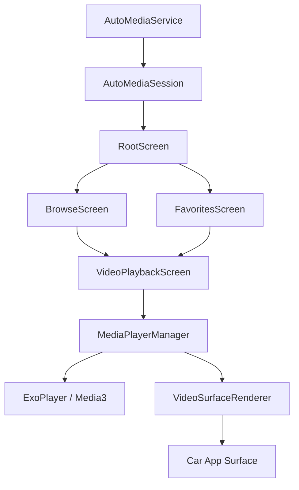

# Architecture

> Auto-generated by /map on 2026-04-21

## Overview

A media player application designed specifically for Android Auto, supporting video playback (when safe) and integration with Local, Plex, and Jellyfin media sources.

## Components

### Core Services
- **AutoMediaService**: The lifecycle entry point. Promotes the app to a foreground service with `mediaPlayback` type to satisfy Android 14+ requirements for audio/video output on Android Auto.
- **AutoMediaSession**: Manages the `Session` object required by the Car App Library. It coordinates the `VideoSurfaceRenderer` and provides a `NavigationStack` for screen transitions.

### Media Engine
- **MediaPlayerManager**: A singleton wrapper around `ExoPlayer`. It handles:
    - Audio focus and "becoming noisy" events.
    - Attaching/detaching the car display `Surface`.
    - Applying `Presentation` effects to ensure correct aspect ratios on raw automotive surfaces.
    - Periodic persistence of playback position.
- **VideoSurfaceRenderer**: Implements `SurfaceCallback`. It bridges the `SurfaceContainer` provided by Android Auto to the `ExoPlayer` instance and handles window/visible area changes.

### Navigation & UI (Screens)
- **RootScreen**: The main dashboard with navigation buttons.
- **BrowseScreen**: An hierarchical browser for discovering media from Plex, Jellyfin, or local storage.
- **VideoPlaybackScreen**: A custom player UI that provides play/pause, seek, and progress tracking. It works in tandem with the background surface rendering.

### Data Layer
- **MediaRepository**: Unified interface for fetching media items.
- **JellyfinRepository / PlexRepository**: Handle API communication, authentication (headers), and model mapping for remote sources.
- **PlaybackRepository**: Manages resume-playback states using DataStore.
- **FavoriteRepository**: Manages user favorites.

## Data Flow

1. **Connection**: `AutoMediaService` is bound by Android Auto -> `AutoMediaSession` is created.
2. **Surface Setup**: `VideoSurfaceRenderer` receives `onSurfaceAvailable` -> `MediaPlayerManager` attaches the `Surface`.
3. **Discovery**: User navigates `RootScreen` -> `BrowseScreen` -> Selects a `MediaItem`.
4. **Playback**: `VideoPlaybackScreen` calls `MediaPlayerManager.playWithHeaders()` -> `ExoPlayer` prepares the stream with necessary auth headers -> Video is rendered to the car `Surface`.
5. **Persistence**: `MediaPlayerManager` periodically saves position to `PlaybackRepository`.

## Integration Points

| Service | Type | Purpose |
|---------|------|---------|
| Plex | REST API | Remote media discovery and streaming |
| Jellyfin | REST API | Remote media discovery and streaming |
| Android Auto | Car App Library | System-level projection and UI rendering |

## Technical Debt

- [ ] **Surface Transformation**: Complete the implementation of scaling/transformations in `VideoSurfaceRenderer.kt` (line 126).
- [ ] **Favorite Playback**: Add logic to `FavoritesScreen.kt` to reconstruction `MediaItem`s for playback from saved favorite data (line 41).
- [ ] **Security**: Transition away from `ALLOW_ALL_HOSTS_VALIDATOR` in `AutoMediaService` for production/Play Store builds.
- [ ] **Edge Cases**: Improve error handling for transient network failures during long-duration streams.

## Conventions

- **Pattern**: Clean Architecture (Data/Service/Car layers).
- **DI**: Dagger Hilt for dependency injection.
- **Concurrency**: Kotlin Coroutines and Flows for state updates.
- **Media**: Media3 / ExoPlayer for all playback logic.
